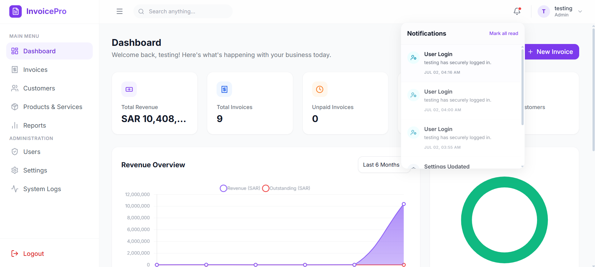
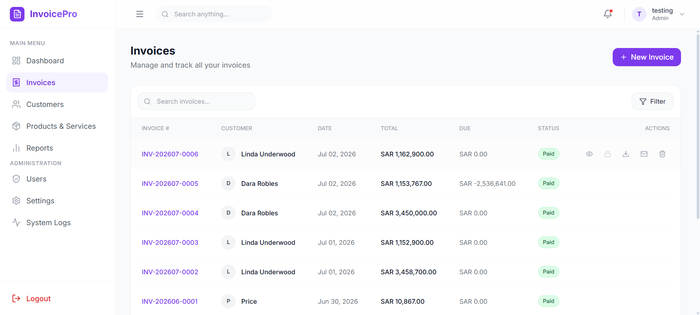
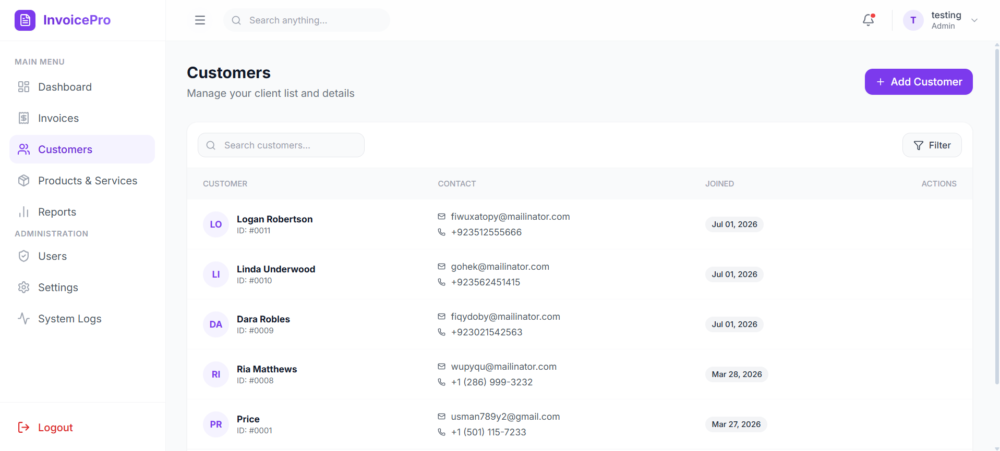
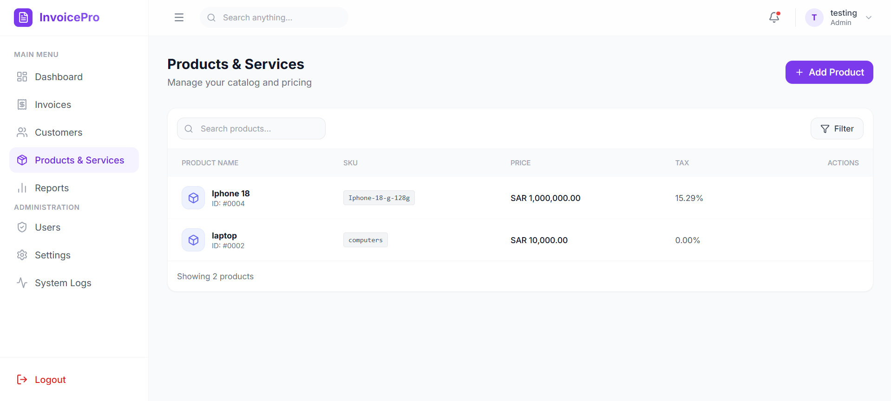
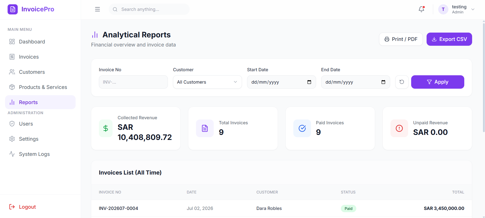
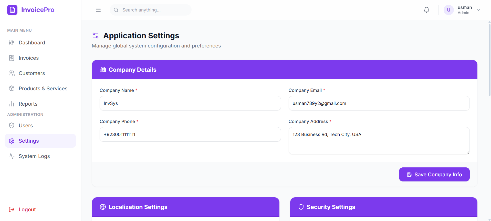
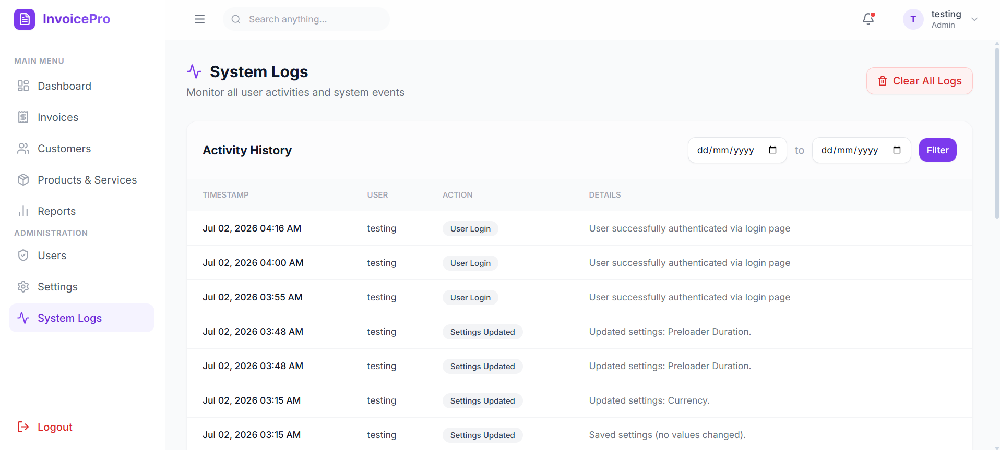
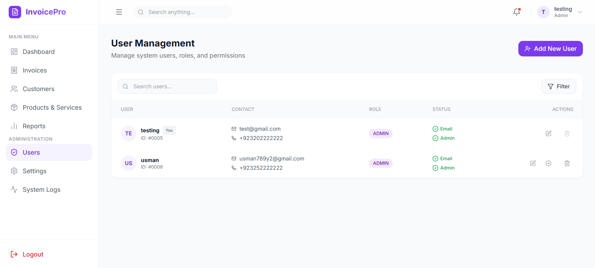

# Premium SaaS Invoice Management System

A beautiful, premium, production-ready invoicing dashboard built with HTML5, Tailwind CSS, Vanilla JS, and PHP/MySQL. Designed with inspiration from top-tier SaaS platforms like Stripe, Vercel, and Linear.

## 📸 Screenshots

| Dashboard | Invoice Preview |
| :---: | :---: |
|  |  |

| Customers | Products & Services |
| :---: | :---: |
|  |  |

| Reports | Settings |
| :---: | :---: |
|  |  |

| System Logs | Users |
| :---: | :---: |
|  |  |

## ✨ Premium Features

- **Gorgeous Dashboard**: Fluid responsive grid, micro-animations, glassmorphism UI, and beautifully styled charts (via Chart.js).
- **Premium Widgets**: Month-over-Month (MoM) growth indicators with continuous floating animations, activity timelines, and live revenue leaderboards (Top Customers & Top Products).
- **Glassmorphism Navbar**: Advanced frosted glass effects (`backdrop-blur-md`) that beautifully blur page content as you scroll beneath it.
- **Flawless Hover States**: Smooth, non-glitchy lift transitions (`-translate-y-1`) with soft purple ambient shadows (`shadow-brand-500/10`) on all interactive cards.
- **Robust Backend**: Vanilla PHP backend integrated securely with MySQL, handling invoices, products, customers, payments, and an activity log.

## 🚀 Installation & Setup

1. **Prerequisites**: Ensure you have a local server environment like XAMPP, WAMP, or MAMP installed.
2. **Clone the Repo**: 
   ```bash
   git clone <your-repo-url>
   cd saasinvoicesys
   ```
3. **Database Setup**:
   - Open PHPMyAdmin or your preferred MySQL client.
   - Create a new database named `invoice_db`.
   - Import the provided `database.sql` file into this database. This includes the entire schema and default settings.
4. **Configuration**:
   - Open `config/db.php`.
   - Verify the database credentials (default is `root` with no password for XAMPP).
5. **Run**:
   - Place the project folder inside your `htdocs` (or equivalent) directory.
   - Navigate to `http://localhost/saasinvoicesys` in your browser.

## 🎨 Tech Stack
- **Frontend**: HTML5, Vanilla JavaScript, Tailwind CSS (via CDN)
- **Backend**: PHP 8+
- **Database**: MySQL
- **Icons**: Lucide Icons
- **Charts**: Chart.js

## 🛡️ Best Practices Implemented
- Completely custom UI components without relying on bulky frontend frameworks.
- Safe flexbox layouts that prevent text overlap on massive revenue numbers.
- Beautiful, highly-polished aesthetics suitable for a commercial, enterprise-grade SaaS product.
